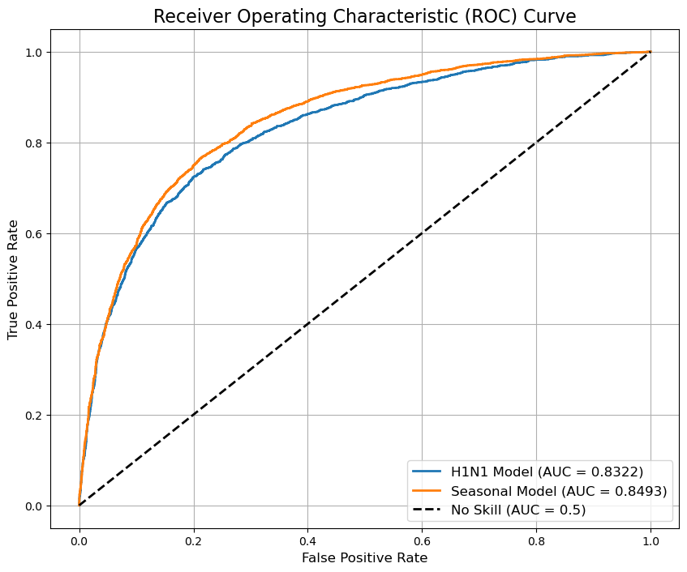

# Flu Shot Vaccination Prediction

This project analyzes survey data to predict whether individuals received the H1N1 and seasonal flu vaccines. The primary goal is to build two distinct binary classification models, one for each vaccine, and evaluate their performance.

The analysis follows a structured pipeline:
1.  **Exploratory Data Analysis (EDA)** to understand feature distributions and correlations.
2.  **Custom Preprocessing** tailored to the specific needs of each model.
3.  **Logistic Regression Modeling** encapsulated within scikit-learn pipelines.
4.  **Performance Evaluation** using the ROC AUC metric.

## 📂 Dataset

The project uses two CSV files:
*   `training_set_features.csv`: Contains the input features, which include demographic information, opinions, and health behaviors of survey respondents.
*   `training_set_labels.csv`: Contains the binary target labels: `h1n1_vaccine` and `seasonal_vaccine`.

## ⚙️ Project Workflow

### 1. Exploratory Data Analysis (EDA)

A thorough EDA was conducted to inform feature selection and preprocessing strategies. Key insights include:

*   **Target Variable Imbalance**: The `seasonal_vaccine` target is well-balanced, while the `h1n1_vaccine` target is moderately imbalanced. This observation informed the use of stratified sampling during the train-test split.
*   **Feature Correlation**: `ydata-profiling` was used to generate a comprehensive report, revealing high correlations between certain features (e.g., `doctor_recc_h1n1` and `doctor_recc_seasonal`).
*   **Feature-Target Relationship**: Stacked bar charts were used to visualize the vaccination rate against various opinion and demographic features. A strong correlation was observed between vaccination likelihood and factors like:
    *   Level of concern about the flu.
    *   Opinion on vaccine effectiveness.
    *   Perceived risk of contracting the flu.
    *   Doctor's recommendation.
*   **Feature Selection**: Several features showed little to no correlation with the target variables (e.g., `education`, `income_poverty`) and were subsequently dropped from the respective models to reduce noise and improve efficiency.

### 2. Preprocessing and Feature Engineering

Two separate, custom preprocessing pipelines were created using `sklearn.pipeline.Pipeline` and `FunctionTransformer` to handle the unique feature sets for each model.

**H1N1 Vaccine Model Preprocessing:**
*   **Feature Dropping**: Columns with low correlation to the H1N1 vaccine were removed.
*   **Encoding**: Categorical features were encoded using `OneHotEncoder`.

**Seasonal Flu Vaccine Model Preprocessing:**
*   **Feature Dropping**: A different set of columns with low correlation to the seasonal vaccine was removed.
*   **Encoding**:
    *   `OneHotEncoder` was used for nominal categorical features.
    *   `OrdinalEncoder` was used for the `age_group` feature to preserve its inherent order.
*   **Imputation**: `SimpleImputer` with a `median` strategy was used to handle missing numerical values.
*   **Scaling**: `StandardScaler` was applied to scale the features.

### 3. Modeling

Two separate `LogisticRegression` models were built, one for each vaccine prediction task.

*   **Regularization**: L2 regularization (`penalty='l2'`) was used to handle potential multicollinearity identified during EDA and to prevent overfitting.
*   **Pipelines**: The entire workflow (encoding, imputation, scaling, and modeling) was encapsulated in a `Pipeline` object for robustness and to prevent data leakage.

### 4. Training and Evaluation

*   **Data Split**: A single, unified `train_test_split` was performed on the full dataset **before** feature selection. The split was stratified on both target labels to ensure that the training and evaluation sets for both models contained the same respondents and maintained the original class distributions.
*   **Evaluation Metric**: The primary metric for evaluation was the **Area Under the Receiver Operating Characteristic Curve (ROC AUC)**, which is well-suited for binary classification tasks, especially with class imbalance.

## 📈 Key Results

The models achieved excellent predictive performance on the unseen evaluation data:

*   **H1N1 Vaccine Model**: **ROC AUC = 0.8322**
*   **Seasonal Flu Vaccine Model**: **ROC AUC = 0.8493**

## 📝 Conclusion

Both models demonstrated strong predictive power, significantly outperforming a random-guess baseline (AUC = 0.5). The high AUC scores indicate that the selected features and modeling approach are highly effective at distinguishing between individuals who did and did not get vaccinated.

The seasonal flu model performed slightly better, suggesting that the features in the dataset are more predictive of traditional, yearly vaccination habits compared to the one-time H1N1 vaccination campaign. These models could be used by public health organizations to identify and target interventions towards populations less likely to be vaccinated.